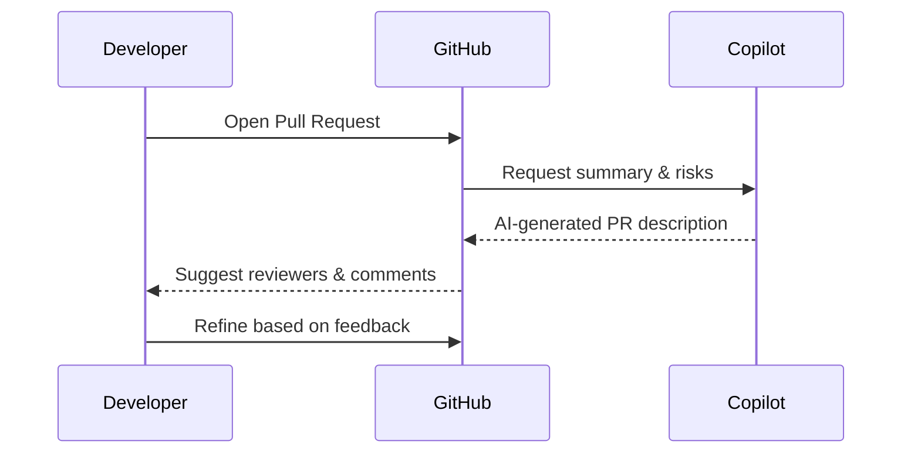

---
# 2. GitHub Copilot for Individuals and Teams
---

layout: section
class: 'bg-gradient-to-br from-purple-900 to-slate-900 text-white'

# 2. GitHub Copilot for Individuals and Teams

<!-- [20:00–21:00] Transition into hands-on Copilot usage: editors, CLI, and in GitHub. Image prompt: "split-screen illustration of a developer editing code with AI suggestions on the left and a team collaborating on PRs with AI help on the right". -->

---

layout: two-cols

## Copilot in the editor

<v-clicks>
- Inline suggestions for code, tests, and docs
- Natural language to code ("Write a method that…")
- Works best with good naming, comments, and small steps
- Guardrails: review suggestions like junior colleague code
</v-clicks>

::right::

```csharp
public class OrderService
{
    // Prompt Copilot:
    // "Add a method to calculate the total price
    //  of all order lines, including tax."

    public decimal CalculateTotalWithTax(
        IEnumerable<OrderLine> lines,
        decimal taxRate)
    {
        var subtotal = lines.Sum(l => l.Quantity * l.UnitPrice);
        var tax = subtotal * taxRate;
        return subtotal + tax;
    }
}
```

<!-- [21:00–26:00] Explain how you would steer Copilot to generate this method via comments and good naming. Emphasize C# examples for the audience. Image prompt: "IDE screenshot-style illustration showing C# code with AI suggestion tooltip, stylized in flat illustration form". -->

---

layout: default

## Demo 1 – Copilot in the editor

<v-clicks>
- Start from an empty C# class or small API
- Use comments to ask for business logic and tests
- Show quick refactoring with Copilot’s help
- Highlight how to accept, modify, or discard suggestions
</v-clicks>

<!-- [26:00–38:00] Live demo idea: open a small C# project (e.g., minimal Web API or service class). Add a new feature by writing comments and method signatures, then accept and refine Copilot suggestions. Emphasize iterative prompting and code review mindset. Image prompt: "developer live-coding on stage with C# code projected behind, subtle AI glow around suggestion lines". -->

---

layout: two-cols

## Copilot in PRs and on GitHub

<v-clicks>
- AI-generated PR descriptions and change summaries
- Suggested reviewers and risk hotspots
- Inline code review suggestions in diffs
- Natural language questions about a PR ("Why did we change this?")
</v-clicks>

::right::



<!-- [38:00–43:00] Describe how AI features can speed up the PR process: generating descriptions, summarizing big diffs, and highlighting potential issues. Image prompt: "pull request screen with highlighted AI-generated description and comments, stylized and de-identified". -->

---

layout: default

## Demo 2 – AI-assisted PR review

<v-clicks>
- Take a non-trivial PR with multiple files
- Use AI to summarize the change and risks
- Ask AI to propose tests or edge cases
- Show how to accept or tweak review suggestions
</v-clicks>

<!-- [43:00–55:00] Demo idea: open an existing PR in a demo repo. Use GitHub’s AI features (or describe them if not enabled) to generate a summary, then ask questions like "What could break?" or "Which files are most risky?". Image prompt: "speaker pointing at a PR diff on a big screen with AI annotations around it". -->
