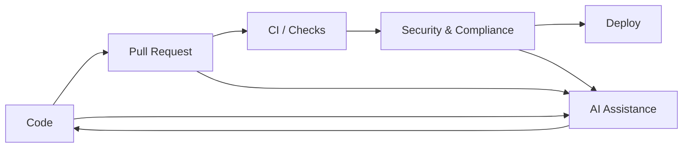

---
# 1. Why AI on the GitHub Platform
layout: section
class: 'bg-gradient-to-br from-purple-900 to-slate-900 text-white'
---

# 1. Why AI on the GitHub Platform

<!-- [12:00–13:00] Use this dark, image-heavy section slide to transition into the first chapter. Image prompt: "wide shot of a software delivery pipeline visualized as a road lit by AI-powered signposts, GitHub logo subtly integrated, dark background with neon purple highlights". -->

---
layout: two-cols
---

## From code host to AI platform

<v-clicks>
- GitHub used to be mostly about repos, issues, and PRs
- Now: AI assistance where you write, review, and manage work
- Tight loop: code → feedback → security → docs → learning
- AI operates on your context: repos, org policies, history
</v-clicks>

::right::

<!-- [13:00–17:00] Explain that AI is being woven into each step, not a separate tool. Walk through the mermaid diagram and how AI participates in this loop. Image prompt: "diagram-like illustration of a circular DevOps loop enhanced with AI nodes, modern and minimal, purple and teal". -->

---
layout: image-left
---

## What problems are we solving?

<v-clicks>
- Repetitive boilerplate and glue code
- Slow PR cycles and unclear feedback
- Security issues discovered too late
- Out-of-date documentation and onboarding pain
- Fragmented tooling and tribal knowledge
</v-clicks>

<!-- [17:00–20:00] Invite the audience to nod along: these pain points are universal. Set up the idea that AI on GitHub should target these concrete problems, not abstract "magic". Image prompt: "comic-style panel of a tired developer drowning in sticky notes labeled bugs, PRs, docs, security, with an AI GitHub assistant offering a lifebuoy". -->
