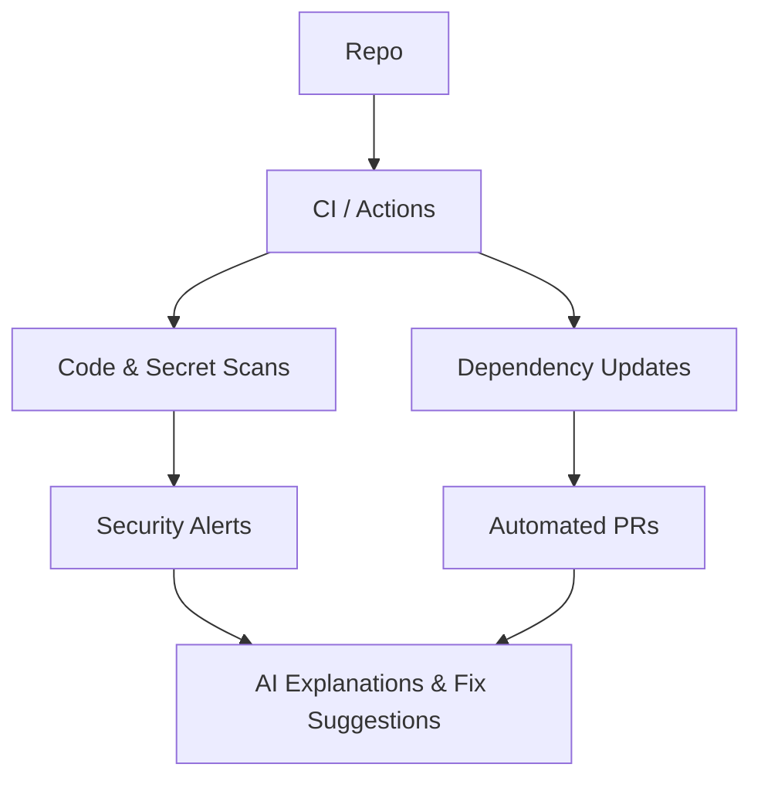

---
# 4. AI for Security and Governance
layout: section
class: 'bg-gradient-to-br from-purple-900 to-slate-900 text-white'
---

# 4. AI for Security and Governance

<!-- [73:00–74:00] Transition into risk reduction and governance: Dependabot, code scanning, and policy-as-code enhanced by AI. Image prompt: "shield-shaped diagram overlaying a GitHub repo, AI signals scanning dependencies and code". -->

---
layout: two-cols
---

## Security signals on GitHub

<v-clicks>
- Dependabot alerts and automated dependency updates
- Code scanning for vulnerabilities and code smells
- Secret scanning to catch leaked credentials
- Policy checks in CI (branch protection, status checks)
</v-clicks>

::right::



<!-- [74:00–80:00] Walk through how security features are already present, and AI can sit on top to explain, prioritize, and suggest fixes. Image prompt: "dashboard-style illustration of security alerts with AI-generated explanations next to them". -->

---
layout: two-cols
---

## AI-assisted security triage

<v-clicks>
- Summarize security alerts for a repository or org
- Ask "Which issues are most critical?" or "What should we fix first?"
- Generate remediation PR descriptions and checklists
- Explain vulnerabilities in plain language for developers
</v-clicks>

::right::

```csharp
// Example vulnerable code snippet
public async Task<IActionResult> GetUser(string id)
{
  var sql = $"SELECT * FROM Users WHERE Id = '{id}'";
  var user = await _db.Users
    .FromSqlRaw(sql)
    .FirstOrDefaultAsync();
  return Ok(user);
}

// Ask AI: "Explain the risk here and propose
// a parameterized, secure alternative."
```

<!-- [80:00–88:00] Use a simple SQL injection example in C# and show how AI can both explain the vulnerability and help rewrite it. Image prompt: "code snippet with a red warning icon transforming into a green shield after AI fix". -->

---
layout: default
---

## Governance and guardrails

<v-clicks>
- Use AI to generate or explain organization policies
- Ask for checks before merging (e.g., tests, scans, reviews)
- Generate documentation for workflows and compliance
- Summarize repo or org risk posture for stakeholders
</v-clicks>

<!-- [88:00–93:00] Describe how platform teams can use AI to keep policies understandable and visible, instead of hidden in YAML only a few people know. Image prompt: "policy documents hovering above pipelines with AI annotations, clean and modern". -->
