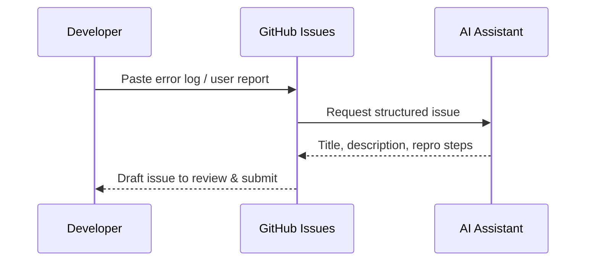

---
# 5. AI for Project Management and Collaboration
layout: section
class: 'bg-gradient-to-br from-purple-900 to-slate-900 text-white'
---

# 5. AI for Project Management and Collaboration

<!-- [93:00–94:00] Shift focus from code to work tracking and collaboration: issues, projects, and documentation aided by AI. Image prompt: "Kanban board with tasks being auto-organized by an AI helper". -->

---
layout: two-cols
---

## Smarter issues and discussions

<v-clicks>
- Generate issue descriptions from error logs or user reports
- Summarize long discussions into key decisions and next steps
- Propose labels, owners, and estimate hints
- Turn unstructured notes into actionable tasks
</v-clicks>

::right::



<!-- [94:00–99:00] Explain how AI can take raw inputs (logs, screenshots, vague descriptions) and turn them into good issues. Image prompt: "AI assistant turning a messy notepad into a clean issue card on a kanban board". -->

---
layout: image-right
---

## GitHub Projects with AI

<v-clicks>
- Summarize project status for stand-ups and reports
- Highlight blocked items and dependencies
- Suggest sprint goals based on backlog and history
- Generate release notes from completed items
</v-clicks>

<!-- [99:00–104:00] Position AI as a helper for project leads: quickly get the "shape" of the work without manually reading every card. Image prompt: "project board view with AI-generated summary box floating above it". -->

---
layout: two-cols
---

## Docs, READMEs, and wikis

<v-clicks>
- Generate or update READMEs from code and usage examples
- Create architecture or ADR summaries from existing docs
- Translate technical details into stakeholder-friendly language
- Keep onboarding docs in sync with repo reality
</v-clicks>

::right::

```csharp
/// <summary>
/// Calculates loyalty points for a customer
/// based on their completed orders.
/// </summary>
public int CalculateLoyaltyPoints(Customer customer)
{
    // ... implementation ...
}

// Ask AI: "Draft a README section that explains
// how loyalty points are calculated and used
// in the checkout flow."
```

<!-- [104:00–109:00] Connect C# XML comments and well-structured code to higher-level docs generated with AI. Image prompt: "developer reviewing a README with highlighted AI-suggested paragraphs". -->
