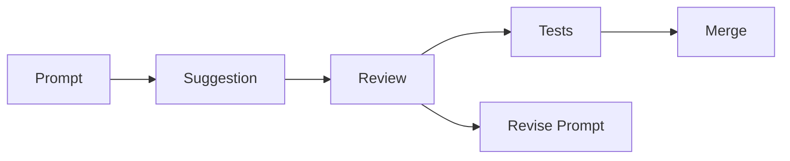

---
# 7. Best Practices, Limits, and Pitfalls
layout: section
class: 'bg-gradient-to-br from-purple-900 to-slate-900 text-white'
---

# 7. Best Practices, Limits, and Pitfalls

<!-- [121:00–122:00] Prepare the audience for a realistic, balanced view: how to use AI responsibly and effectively. Image prompt: "two-path road sign: 'Boost' and 'Risk', with an AI advisor helping choose a safe path". -->

---
layout: two-cols
---

## Using AI like a teammate

<v-clicks>
- Treat AI suggestions as drafts, not ground truth
- Keep humans accountable for design and decisions
- Pair AI with tests, linters, and reviews
- Encourage experimentation, but capture learnings
</v-clicks>

::right::



<!-- [122:00–127:00] Position AI as a teammate in an iterative loop, not a replacement for engineering judgment. Image prompt: "team of developers and an AI avatar around a whiteboard, all contributing equally". -->

---
layout: image-right
---

## Typical pitfalls

<v-clicks>
- Over-trusting generated code without tests
- Letting style and architecture drift
- Leaking secrets or private data in prompts
- Ignoring licensing and compliance requirements
</v-clicks>

<!-- [127:00–131:00] Share war stories if you have them: subtle bugs, performance issues, or security problems introduced via AI suggestions. Image prompt: "warning sign over code with subtle glitch effects, representing hidden bugs". -->

---
layout: two-cols
---

## Org-level practices

<v-clicks>
- Define guidelines for when and how to use AI
- Provide sample prompts and repo templates
- Monitor usage and collect feedback
- Train champions in each team to help others
</v-clicks>

::right::

```csharp
// Example: coding guidelines snippet
public class AiUsageGuidelines
{
    public const string Principle =
        "AI assists, humans own the result.";
}
```

<!-- [131:00–136:00] Highlight that platform teams can codify best practices and distribute them through templates, docs, and training. Image prompt: "guideline document icon connected to multiple repo icons". -->
