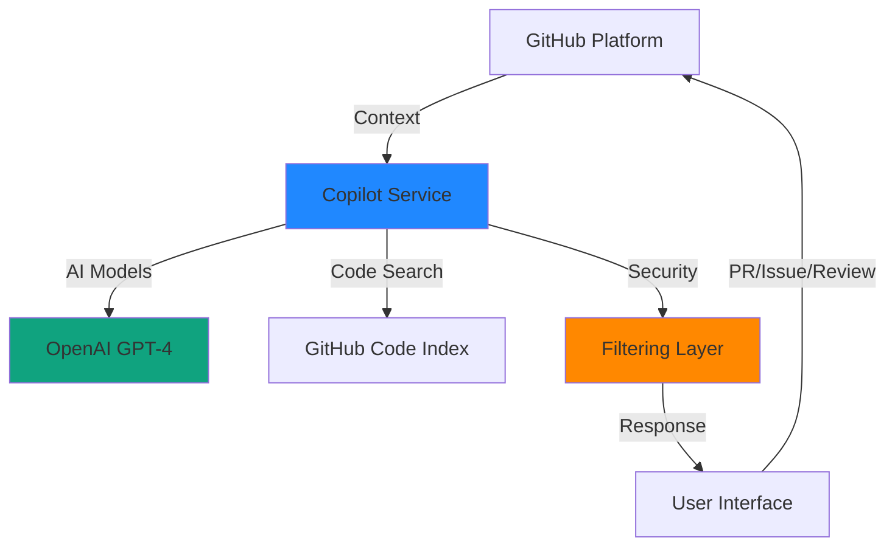
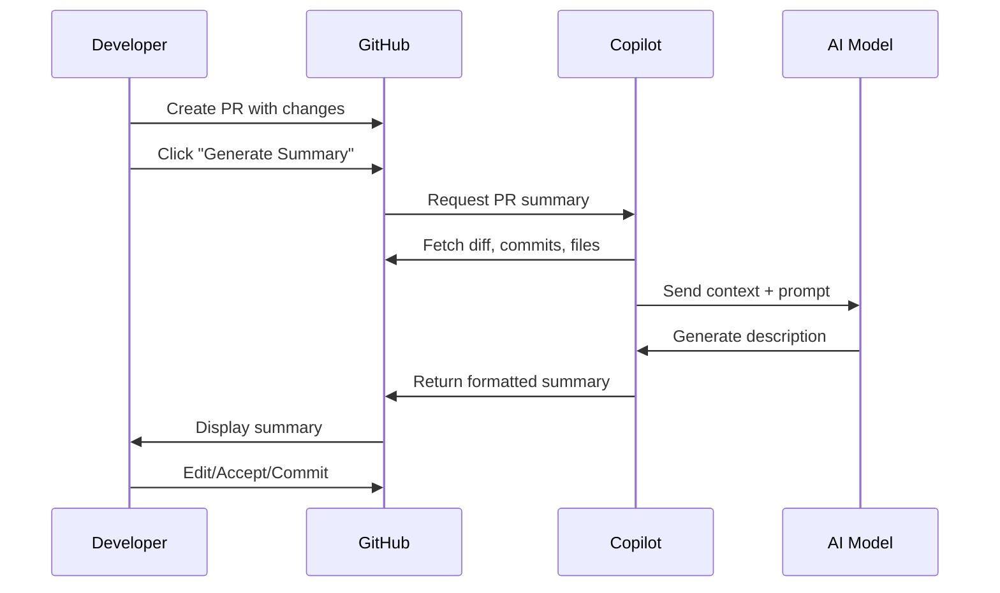
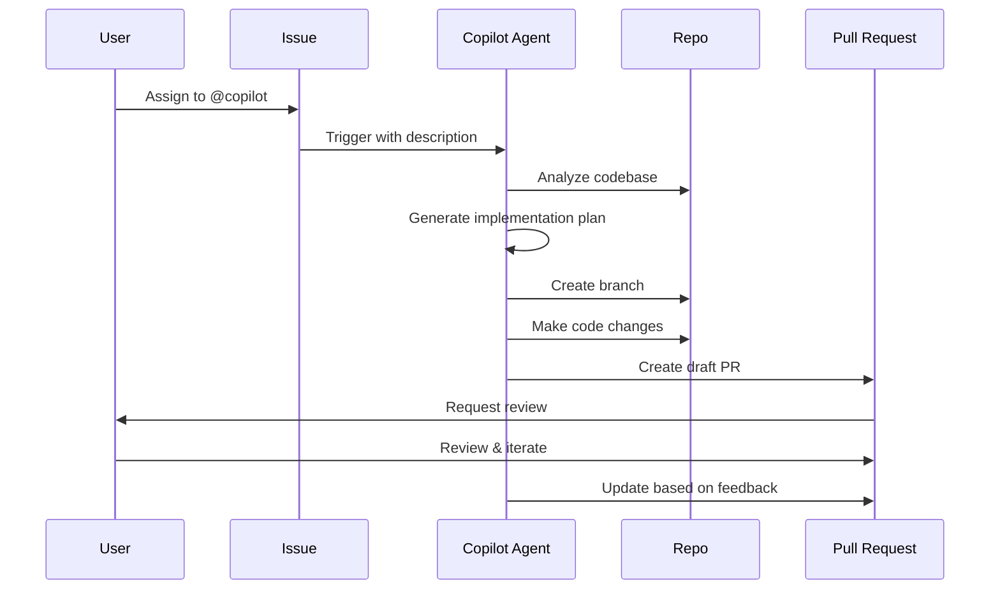

# Part 1: Foundation

Understanding GitHub Copilot on the Platform

---
layout: default
---

# What is GitHub Copilot?

## Traditional View
- AI pair programmer
- Code completions
- Works in your IDE
- Suggests code as you type

## Platform View
- AI assistant across GitHub
- Works in pull requests
- Assists with issues
- Helps with code reviews
- Automates workflows

💡 <strong>Key Insight:</strong> Copilot is not just in your editor - it's embedded throughout the GitHub platform

<!--
IMAGE SUGGESTION: Split diagram showing "IDE Copilot" vs "Platform Copilot" with icons
Many developers only know Copilot as code completion in their IDE. Today we'll explore the full platform integration.
-->

---
layout: default
---
# GitHub Copilot on Platform: What It Is

## Core Capabilities

1. **PR Summaries** - Auto-generate descriptions
2. **Code Review** - AI-powered suggestions  
3. **Issue Analysis** - Context understanding
4. **Coding Agent** - Autonomous implementation
5. **Workflow Integration** - CI/CD assistance
6. **Spaces** - Light RAG System

## Made For

- **Developers** - All experience levels
- **Teams** - Collaborative workflows
- **Organizations** - Enterprise scale
- **OSS Projects** - Community contributions

<!--
IMAGE SUGGESTION: Circular workflow diagram showing: Issue → Branch → Code → PR → Review → Merge with Copilot icons at each step
-->

---
layout: default
---

# The Intention: Why Use Copilot on Platform?

<v-clicks>

## 🚀 Speed
- Reduce time writing PR descriptions
- Faster code reviews
- Quick issue triaging

## 🎯 Quality
- Consistent documentation
- Catch issues early
- Improve code review depth

</v-clicks>

<v-clicks>

## 🤝 Collaboration
- Better communication
- Lower barriers for contributors
- Knowledge sharing

## ⚡ Automation
- Automate repetitive tasks
- Focus on creative problem-solving
- Reduce context switching

</v-clicks>

<!--
The platform integration solves problems that IDE-only Copilot cannot address - collaboration and workflow automation.
-->

---
layout: default
---

# How Can I Use It?

## Access Points

<v-clicks>

1. **Pull Requests**
   - Summary generation
   - Review comments
   - Suggested changes

2. **Issues**
   - Assign to Copilot coding agent
   - Generate implementation plans
   - Track progress

3. **Code Reviews**
   - Inline suggestions
   - Security scanning
   - Best practice checks

</v-clicks>

<v-click>

## Requirements

✅ GitHub Copilot subscription
- Individual
- Business
- Enterprise

✅ Repository access

✅ Enabled features
- Copilot Chat
- Coding agent (if used)

</v-click>

<!--
IMAGE SUGGESTION: Screenshot collage showing Copilot in different GitHub UI locations
-->

---
layout: center
---

# Architecture & How It Works

## Understanding the Technology

<!--
IMAGE SUGGESTION: High-level architecture diagram title slide
-->

---

# Copilot Architecture Overview

## Data Flow
1. User action triggers Copilot
2. Context gathered from repo
3. Request to AI models
4. Security/policy filtering
5. Response rendered

## Key Components
- **Platform Integration** - Native GitHub UI
- **Context Engine** - Repository awareness
- **AI Models** - GPT-4 based
- **Security Layer** - Enterprise controls

<!--
The architecture shows how Copilot integrates deeply with GitHub's platform while maintaining security boundaries.
-->

---

# Context Gathering: What Copilot Knows

## Repository Context
- File structure
- Code patterns
- Dependencies
- Recent changes
- Commit history

## Issue/PR Context
- Description
- Comments
- Linked items
- Labels
- Reviewers
- Status

## User Context
- Your permissions
- Organization rules
- Team conventions
- Previous interactions

⚠️ <strong>Privacy:</strong> Copilot only accesses what you have permission to see

<!--
IMAGE SUGGESTION: Layered context diagram showing how different sources feed into Copilot
Understanding context is crucial - it's why platform Copilot can be more helpful than standalone AI.
-->

---

# How It Works: Pull Request Summaries

<!--
This sequence shows the interaction between components when generating a PR summary.
-->

---

# How It Works: Coding Agent

<!--
The coding agent is the most advanced feature - it can autonomously implement features based on issue descriptions.
-->

---

# Processing Models

## GPT-4 Based Models
- Natural language understanding
- Code generation
- Context-aware responses
- Multi-turn conversations

### Model Characteristics
- Large context window
- Code-specific training
- Safety filtering
- Enterprise-grade

## Specialized Tasks

**Code Review:**
- Pattern recognition
- Best practice validation
- Security vulnerability detection

**PR Summaries:**
- Diff analysis
- Change categorization
- Impact assessment

**Issue Processing:**
- Intent understanding
- Requirement extraction
- Solution planning

<!--
Different tasks may use optimized versions of models - all built on GPT-4 foundation.
-->
