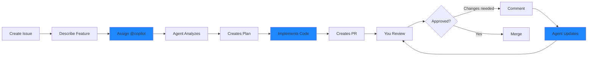

# Part 2: Deep Dive

Real-World Use Cases & Comparison

---

# Daily Work Use Case 1
## PR Summary Generation

<div class="grid grid-cols-2 gap-8">

<div>

### The Problem
- Writing good PR descriptions takes time
- Easy to miss important changes
- Inconsistent quality
- Context lost between commits

### The Solution
- Click "Copilot Summary"
- Reviews all changes
- Generates structured description
- Highlights key changes

</div>

<div>

### What Gets Generated

```markdown
## Summary
Refactored authentication service
to use dependency injection

## Changes
- Added IAuthService interface
- Implemented OAuth2 flow
- Updated unit tests
- Added configuration validation

## Impact
- Breaking: Changed constructor params
- Migration guide in docs/auth.md
```

</div>

</div>

<!--
IMAGE SUGGESTION: Before/after screenshot of empty PR vs Copilot-generated description
DEMO PREPARATION: Have a PR ready with multiple commits to demonstrate
-->

---

# Daily Work Use Case 2
## Code Review Assistance

<div class="grid grid-cols-2 gap-6">

<div>

### Traditional Review
❌ Time-consuming
❌ Easy to miss issues
❌ Junior devs hesitant
❌ Inconsistent standards

### With Copilot
✅ AI pre-review
✅ Catches common issues
✅ Suggests improvements
✅ Educational comments

</div>

<div>

### Example Review Comment

**Copilot suggests:**

```csharp
// Current code
public async Task<User> GetUser(int id)
{
    return await _db.Users
        .Where(u => u.Id == id)
        .FirstOrDefault();
}

// Suggested improvement
public async Task<User?> GetUserAsync(int id,
    CancellationToken ct = default)
{
    return await _db.Users
        .AsNoTracking()
        .FirstOrDefaultAsync(
            u => u.Id == id, ct);
}
```

**Reasoning:** Add nullable return, async suffix, no-tracking, and cancellation support

</div>

</div>

<!--
DEMO PREPARATION: Prepare PR with code that can be improved (missing async patterns, no null checks, etc.)
-->

---

# Daily Work Use Case 3
## Issue to Implementation (Coding Agent)

<div class="text-sm">



</div>

### Real Example

**Issue:** "Add JSON export functionality to UserReport class"

**Copilot Agent:**
1. ✅ Analyzes existing UserReport class
2. ✅ Adds System.Text.Json dependency
3. ✅ Implements ExportToJson method
4. ✅ Adds unit tests
5. ✅ Updates documentation

<!--
This is the most powerful feature - autonomous implementation based on natural language requirements.
DEMO PREPARATION: Create an issue that's well-scoped for live demonstration
-->

---

# Daily Work Use Case 4
## Security & Best Practices

<div class="grid grid-cols-2 gap-8">

<div>

### Automatic Checks

**Security:**
- Hardcoded secrets detection
- SQL injection risks
- XSS vulnerabilities
- Insecure dependencies

**Best Practices:**
- Code patterns
- Naming conventions
- Performance issues
- Resource management

</div>

<div>

### Example Detection

```csharp
// ⚠️ Copilot flags this
public class ConfigService
{
    private string apiKey = 
        "sk-1234567890abcdef";
    
    public string GetApiKey() 
        => apiKey;
}

// ✅ Suggests this instead
public class ConfigService
{
    private readonly IConfiguration _config;
    
    public ConfigService(IConfiguration config)
    {
        _config = config;
    }
    
    public string GetApiKey() 
        => _config["ApiKey"];
}
```

**Copilot explains:** Never hardcode secrets. Use configuration providers.

</div>

</div>

<!--
IMAGE SUGGESTION: Shield icon with checkmarks showing security scanning
-->

---

# Daily Work Use Case 5
## Documentation & Comments

<div class="grid grid-cols-2 gap-8">

<div>

### What Copilot Helps With

**PR Descriptions:**
- Change summaries
- Breaking changes
- Migration guides
- Testing notes

**Issue Responses:**
- Root cause analysis
- Solution proposals
- Alternative approaches
- Implementation estimates

**Code Documentation:**
- XML doc comments
- README updates
- API documentation

</div>

<div>

### Example: Auto-Generated Docs

```csharp
/// <summary>
/// Asynchronously retrieves a user by ID
/// with optional related entities.
/// </summary>
/// <param name="id">
/// The unique identifier of the user
/// </param>
/// <param name="includeOrders">
/// Include user's order history
/// </param>
/// <param name="ct">
/// Cancellation token
/// </param>
/// <returns>
/// User entity if found, null otherwise
/// </returns>
/// <exception cref="ArgumentException">
/// Thrown when id is less than 1
/// </exception>
public async Task<User?> GetUserAsync(
    int id,
    bool includeOrders = false,
    CancellationToken ct = default)
{
    // Implementation...
}
```

**Generated by:** Copilot in PR review

</div>

</div>

---

# Comparison: IDE Copilot vs Platform Copilot

<div class="grid grid-cols-2 gap-4 text-sm">

<div>

## IDE Copilot
### (VS Code, Visual Studio)

**Strengths:**
- ✅ Real-time code completion
- ✅ Inline suggestions
- ✅ Works offline (cached)
- ✅ Fast response time
- ✅ Context from open files
- ✅ Multi-language support

**Use Cases:**
- Writing new code
- Refactoring
- Writing tests
- Generating boilerplate
- Quick fixes

**Limitations:**
- ❌ No PR integration
- ❌ No team collaboration features
- ❌ Limited repo-wide context
- ❌ Manual documentation

</div>

<div>

## Platform Copilot
### (GitHub.com)

**Strengths:**
- ✅ PR summaries
- ✅ Code review assistance
- ✅ Issue processing
- ✅ Coding agent
- ✅ Full repository context
- ✅ Team collaboration
- ✅ Workflow automation

**Use Cases:**
- Code reviews
- PR descriptions
- Issue triage
- Feature implementation (agent)
- Documentation
- Team communication

**Limitations:**
- ❌ No real-time completion
- ❌ Requires internet
- ❌ GitHub-specific

</div>

</div>

<div class="mt-4 p-4 bg-blue-500 bg-opacity-10 rounded text-center">
💡 <strong>Best Practice:</strong> Use BOTH together for maximum productivity
</div>

<!--
They complement each other - IDE for coding, Platform for collaboration.
-->

---

# When to Use What?

<div class="grid grid-cols-3 gap-4">

<div>

## IDE Copilot

**During Development:**
- Writing new code
- Implementing methods
- Creating tests
- Refactoring code
- Learning new APIs

**Best For:**
- Individual developer work
- Fast iteration
- Learning & exploration

</div>

<div>

## Platform Copilot

**During Collaboration:**
- Creating PRs
- Code reviews
- Issue management
- Documentation
- Team communication

**Best For:**
- Team workflows
- Quality assurance
- Knowledge sharing
- Automation

</div>

<div>

## Both Together

**Complete Workflow:**
1. IDE: Write code
2. IDE: Write tests
3. Platform: Create PR
4. Platform: Generate summary
5. Platform: Get AI review
6. IDE: Fix issues
7. Platform: Merge

**Result:**
- Faster development
- Better quality
- Less context switching

</div>

</div>

<!--
Understanding when to use each tool is key to maximizing productivity.
-->

---
layout: center
---

# Configuration & Security

## Enterprise-Ready Controls

<!--
IMAGE SUGGESTION: Lock and gear icon combined
-->

---

# Configuration Options

<div class="grid grid-cols-2 gap-8">

<div>

## Organization Level

**GitHub Settings → Copilot:**

- Enable/disable Copilot
- Business vs Individual
- IDE access controls
- Public code matching
- Telemetry settings

**Policies:**
- Repository inclusion/exclusion
- Content filtering
- Data retention
- Geographic restrictions

</div>

<div>

## Repository Level

**Repository Settings:**

- Enable Copilot features
- PR summary generation
- Code review assistance
- Coding agent access

**Branch Protection:**
- Require Copilot review
- Security scanning
- Compliance checks

**Team Settings:**
- User access control
- Feature flags
- Custom policies

</div>

</div>

<!--
Configuration happens at multiple levels for fine-grained control.
-->

---

# Security: Enterprise Controls

<div class="grid grid-cols-2 gap-6">

<div>

## Data Protection

**What's Protected:**
- ✅ Code never used for training
- ✅ Suggestions filtered
- ✅ IP protected
- ✅ Audit logging available

**Compliance:**
- SOC 2 Type II
- GDPR compliant
- Industry standards
- Regular audits

</div>

<div>

## Access Controls

**Authentication:**
- GitHub SSO
- SAML integration
- 2FA enforcement
- Token management

**Authorization:**
- Repository permissions
- Team-based access
- Role-based controls
- Activity monitoring

</div>

</div>

<div class="mt-6 p-4 bg-red-500 bg-opacity-10 rounded">
🔒 <strong>Security First:</strong> Code suggestions are filtered for secrets, PII, and vulnerabilities
</div>

<!--
IMAGE SUGGESTION: Security layers diagram showing authentication, authorization, filtering, and audit
-->

---

# Content Exclusion

<div class="grid grid-cols-2 gap-8">

<div>

## What You Can Exclude

**File Patterns:**
```
# Exclude from Copilot context
*.key
*.pem
secrets/
config/production.json
.env.*
internal/proprietary/
```

**Repository Paths:**
- Specific directories
- File extensions
- Sensitive modules
- Third-party code

</div>

<div>

## Configuration

**In IDE (VS Code/Visual Studio):**

Settings → Copilot:
- Content exclusions
- File patterns
- URL patterns
- Repository rules

**In GitHub:**

Organization settings:
- Organization-wide exclusions
- Per-repository rules
- Automatic pattern detection

### Why Exclude?
- Protect proprietary algorithms
- Exclude generated code
- Compliance requirements
- Reduce noise

</div>

</div>

<!--
Content exclusion ensures sensitive code isn't processed by Copilot.
-->

---

# Security Best Practices

<v-clicks>

## 1. **Audit Regularly**
- Review Copilot usage logs
- Monitor suspicious patterns
- Track security incidents
- Generate compliance reports

## 2. **Train Your Team**
- Understand what Copilot sees
- How to review AI suggestions
- When to use/not use features
- Security implications

## 3. **Configure Properly**
- Set organization policies
- Enable content exclusion
- Require code review
- Enable security scanning

## 4. **Monitor & Iterate**
- Collect feedback
- Adjust policies
- Update exclusions
- Stay current with features

</v-clicks>

<!--
Security is a process, not a one-time configuration.
-->
